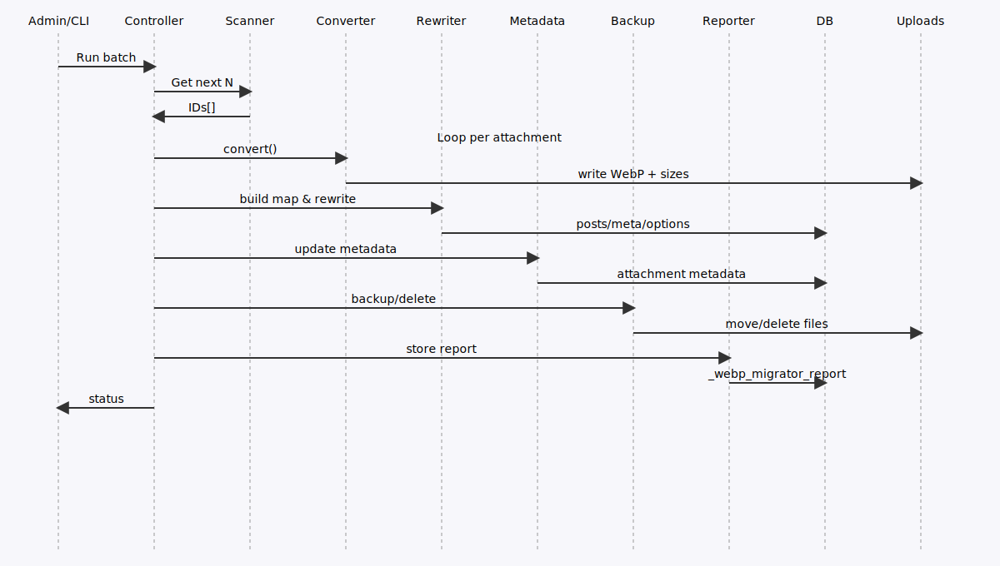
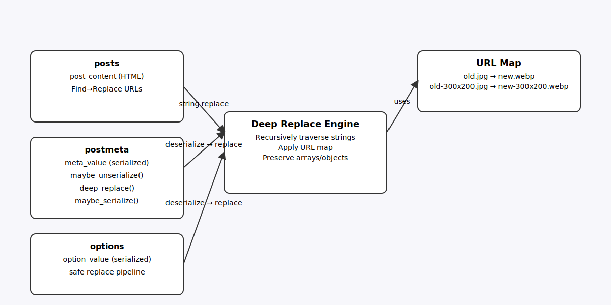

# WebP Safe Migrator — Architecture

**Version:** 2025-08-19

This document describes components, data flow, and persistence for maintainers.

## Overview

## Data Flow

## Sequence

## DB Rewrite

### Options (wp_options)
- {WebP_Safe_Migrator::OPTION} JSON: quality, batch_size, validation, skip_folders, skip_mimes

### Post Meta (wp_postmeta)
- `_webp_migrator_status` — lifecycle state
- `_webp_migrator_backup_dir` — backup path (validation mode)
- `_webp_migrator_report` — JSON: posts, postmeta, options, timestamp

### Attachment Core
- `_wp_attached_file`, `_wp_attachment_metadata`, `post_mime_type=image/webp`, `guid`

### Validation & Commit
- Validation ON: originals moved to `uploads/webp-migrator-backup/<ts>/att-<ID>/`
- Commit deletes backups and marks `committed`

### Skip Rules
- Folders: substring match on uploads-relative path
- MIMEs: exclude from scan

### CLI
`wp webp-migrator run --batch=100 [--no-validate]`
