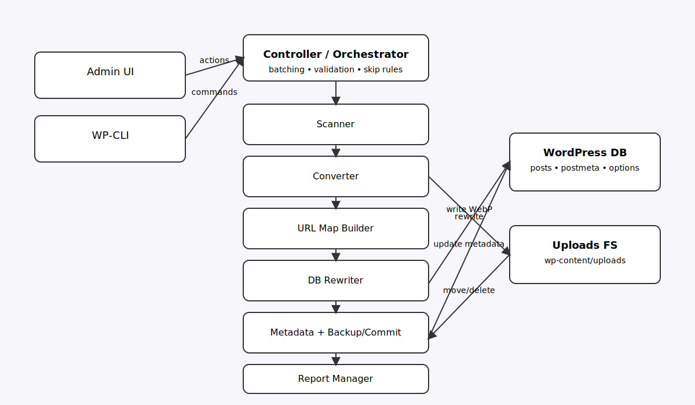
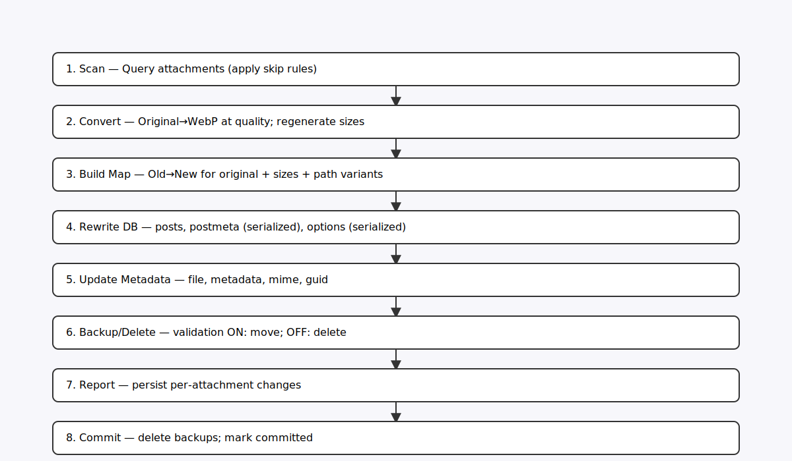
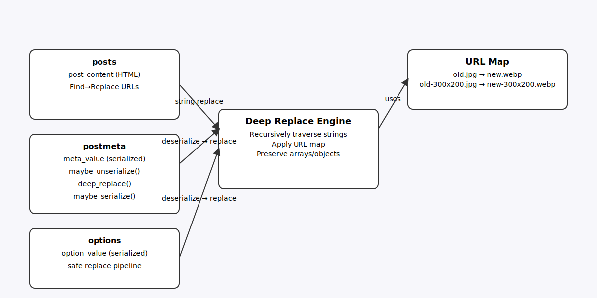
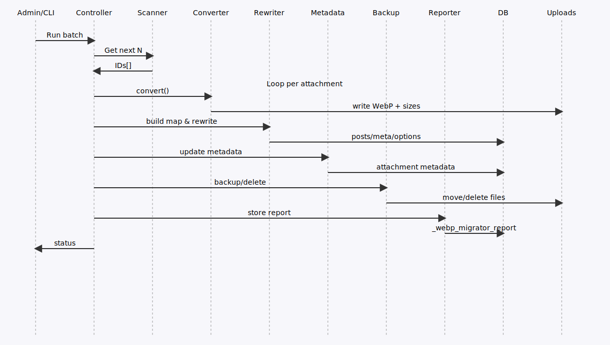

# WebP Safe Migrator — Architecture

**Version:** 2025-01-27 | [📖 Documentation Index](INDEX.md) | [🏠 Main README](../README.md)

## Table of Contents
- [Overview](#overview)
- [System Architecture](#system-architecture)
- [Data Flow](#data-flow)
- [Database Design](#database-design)
- [Component Details](#component-details)
- [API Reference](#api-reference)

This document describes the technical architecture, components, data flow, and persistence mechanisms for maintainers and developers.

## System Architecture


The WebP Safe Migrator follows a modular architecture with clear separation of concerns:

- **Controller/Orchestrator**: Manages batch processing, validation, and skip rules
- **Scanner**: Identifies eligible attachments for conversion
- **Converter**: Handles image conversion and metadata generation
- **URL Map Builder**: Creates mapping between old and new file URLs
- **DB Rewriter**: Updates database references safely
- **Backup/Commit Manager**: Manages file backup and deletion
- **Report Manager**: Tracks and stores conversion reports

## Data Flow


The conversion process follows an 8-step workflow:

1. **Scan** - Query attachments and apply skip rules
2. **Convert** - Transform original to WebP and regenerate sizes
3. **Build Map** - Create URL mappings for original and size variants
4. **Rewrite DB** - Update posts, postmeta, and options tables
5. **Update Metadata** - Modify attachment metadata and properties
6. **Backup/Delete** - Handle original files based on validation mode
7. **Report** - Store detailed change information
8. **Commit** - Finalize deletion of backup files

## Database Rewriting


The database rewriting system handles three main data types:

- **Posts**: Direct string replacement in `post_content`
- **Postmeta**: Safe serialized data handling with deep replacement
- **Options**: Serialized option values with recursive URL updates

## Batch Processing Sequence


The batch processing sequence shows the interaction between system components during a typical conversion batch.

## Database Design

### WordPress Options (wp_options)
The plugin stores configuration in a single option:
- **`webp_safe_migrator_settings`** - JSON configuration containing:
  - `quality` - WebP quality setting (1-100)
  - `batch_size` - Number of attachments per batch
  - `validation` - Validation mode flag
  - `skip_folders` - Folder exclusion rules
  - `skip_mimes` - MIME type exclusion rules

### Post Meta (wp_postmeta)
Per-attachment metadata for tracking conversion state:
- **`_webp_migrator_status`** - Lifecycle state: `converted|relinked|committed|skipped_animated_gif|convert_failed|metadata_failed`
- **`_webp_migrator_backup_dir`** - Backup directory path (validation mode only)
- **`_webp_migrator_report`** - JSON report: posts, postmeta, options, timestamp, statistics

### Attachment Core Updates
Standard WordPress attachment fields updated during conversion:
- **`_wp_attached_file`** - Updated to WebP file path
- **`_wp_attachment_metadata`** - Regenerated metadata for WebP and all sizes
- **`post_mime_type`** - Changed to `image/webp`
- **`guid`** - Updated to WebP URL

## Component Details

### Validation & Commit System
- **Validation ON**: Originals moved to `uploads/webp-migrator-backup/<timestamp>/att-<ID>/`
- **Validation OFF**: Originals deleted immediately after conversion
- **Commit Process**: Deletes backups and marks status as `committed`

### Skip Rules Engine
- **Folder Filtering**: Substring match on uploads-relative path (case-insensitive)
- **MIME Filtering**: Exclude specific MIME types from processing
- **Animated GIF Detection**: Automatically skip animated GIFs unless configured otherwise

### Background Processing
- **Queue Management**: WordPress cron-based job scheduling
- **Progress Tracking**: Real-time progress updates via AJAX
- **Resume Capability**: Continue processing after interruption
- **Resource Management**: Memory and execution time limits

## API Reference

### WP-CLI Commands
```bash
# Basic batch processing
wp webp-migrator run --batch=100

# Disable validation (immediate deletion)
wp webp-migrator run --batch=100 --no-validate

# Background processing
wp webp-migrator run --batch=500 --background
```

### PHP Class Methods
Key methods for developers:
- `WebP_Safe_Migrator::process_attachment($att_id, $quality, $validation_mode)`
- `WebP_Safe_Migrator::get_non_webp_attachments($limit)`
- `WebP_Safe_Migrator::commit_deletions($att_id)`

### WordPress Hooks
Available action and filter hooks:
- `webp_migrator_before_conversion` - Before image conversion
- `webp_migrator_after_conversion` - After successful conversion
- `webp_migrator_progress_updated` - Progress update notifications

---

**🔗 Navigation:** [📖 Documentation Index](INDEX.md) | [🏠 Main README](../README.md) | [📊 Implementation Review](COMPREHENSIVE_REVIEW_SUMMARY.md)
